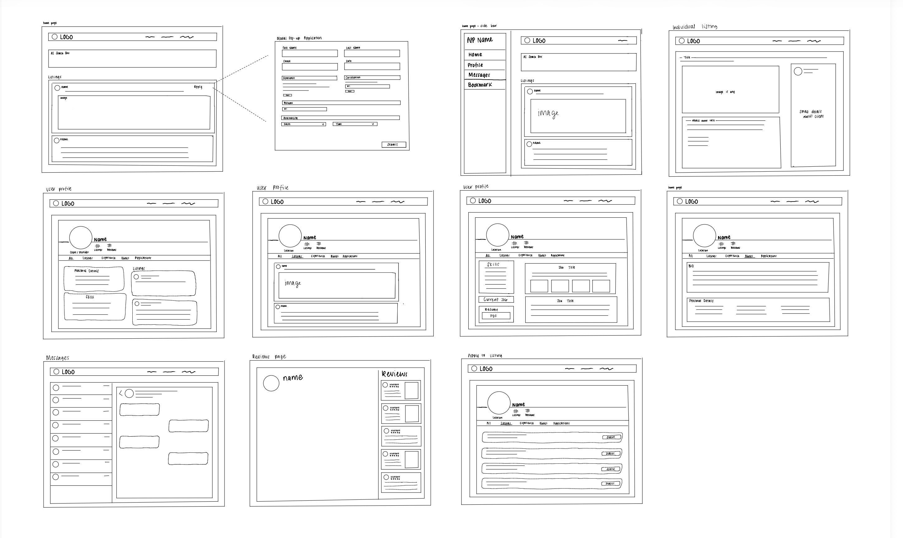

# Project Plan — Side Hustle

---

## 1. Team Name and Pod Members

**Pod name:** Power Panel

**Pod Members:**
- Zainab Adeola
- Ariane Doris Umuhire
- Ardelia Putridaryana

---

## 2. Problem Statement and Solution Description

**Problem Statement**

People who want to earn extra income have no reliable way to discover side hustles that actually match their specific skills, schedule, and financial goals. Whereas people who need services done don't know where to go to discover those who can complete their service for them.

**Solution Description**

The main purpose of our project is to create a centralized platform that connects clients who need tasks, projects, or services completed with workers seeking side hustle income. Clients can post what they need, workers can find opportunities that match their skills and schedule. There is no middleman, just a direct and mutually beneficial connection.

**Target Audience:** People looking for side-hustle income (providers) and people who need a task/service completed (clients).

---

## 3. User Roles and Personas

### User Roles

| Role Name | Description | Notes |
|---|---|---|
| Client | The user who needs a job done. | Can be interchangeable |
| Provider | The user who is looking for a job. | Can be interchangeable |

> Note: A single account can act as both — `is_client` on the `user` table determines the active role (see Data Model). "A client can switch to provider and vice versa."

### User Personas

**Persona 1 — Oscar Grammy**
- **Age:** 17
- **Location:** Oklahoma City, Oklahoma
- **Relationship with technology:** Avid phone user and uses the app weekly for allowance money
- **Motivation:** To get a weekly allowance for leisure spending
- **Pain points:** High school student

**Persona 2 — Aurora Borealis**
- **Age:** 36
- **Location:** Indianapolis, Indiana
- **Relationship with technology:** Uses desktop more often due to work and uses the app occasionally when things need to get done
- **Motivation:** To complete tasks she does not have time to do
- **Pain points:** Orthopedic surgeon who works 12-hour shifts

**Persona 3 — Sara Abraham**
- **Age:** 51
- **Location:** Lincoln, Nebraska
- **Relationship with technology:** Moderately uses technology and is both a mobile and desktop user, but her father George has trouble with it
- **Motivation:** Wants to help her father, who is getting older
- **Pain points:** Daughter of George Abraham (75)

**Persona 4 — Kevin Manzi**
- **Age:** 25
- **Location:** Fort Worth, Texas
- **Relationship with technology:** University student who actively uses all devices (mobile, tablet, desktop)
- **Motivation:** Needs a side hustle to earn extra money
- **Pain points:** Student loans

---

## 4. User Stories

### Core User Stories

| # | User Story (As a... I want... so that...) | Role | Feature Area |
|---|---|---|---|
| 1 | As a client, I want to be able to see a provider's skills, so I can know if they can complete the job I want. | Client | Skills Page |
| 2 | As a client, I need a list of plumbers near me who can quickly fix my sink. | Client | Location Near Me |
| 3 | As a provider, I want to fill out my bio, so my personality can shine through to clients. | Provider | Bio |
| 4 | As a client, I want to be able to show that a job listing has been completed or filled, so I don't get any more providers applying to my listing. | Client | Completed Listing |
| 5 | As a provider, I want to be able to talk with my client about the job, so I can get more information about a listing. | Both | Inbox |
| 6 | As a client, I want to know which provider is qualified and trustworthy for the job, so I can ensure that my job gets done efficiently and effectively. | Client | Reviews |
| 7 | As a client, I want to be able to post my listings with images, so providers can see a visual of the service to be completed. | Client | Post Listings |
| 8 | As a client, I want to be able to post a listing with no images, so I can maintain my privacy regarding the service I need completed. | Client | Post Listing |
| 9 | As a provider, I want to display my previous work, so I can attract new clients. | Provider | Skills Tab |
| 10 | As a provider, I want to set my profile, so I can attract parents looking for a babysitter. | Provider | User Profile |
| 11 | As a client, I want to be able to see all the applicants under my listing, so I can identify providers relevant to the specific listing. | Client | Listing Page |
| 12 | As a provider, I want to be able to click into a listing, so I can get more information about the listing. | Provider | Listing Page |
| 13 | As a provider, I want to be able to scroll through posted listings and see which ones may interest me. | Provider | Feed Scroll |

### AI Feature User Stories

| # | User Story (As a... I want... so that...) | Role | Feature Area |
|---|---|---|---|
| AI 1 | As a client, I want to be matched to someone who can do garden work. | Client | AI Matching |
| AI 2 | As a provider, I want to use AI to see the best-priced jobs that apply to my skills. | Provider | AI Sorting |
| AI 3 | As a client, I want to see a suggested price for my job listing, so more people will apply and consider my listing. | Client | AI Listing Price |
| AI 4 | As a client, I want to see a list of braiders that match my style, so I can choose one who will do my hair. | Client | AI Search |

### Decisions Log — User Stories

- **Story we debated the scope of:** "As a client, I need a list of plumbers near me who can quickly fix my sink." We debated whether to keep this story plumber-specific or broaden it to all local services. **How we resolved it:** We kept the user-facing example in the story for clarity, but scoped implementation under `Location Near Me` so it supports any service category in the product.
- **Story we cut (and why):** "As a client, I want to upload videos in my listing so providers can better understand my request." We cut this story because it adds high storage and moderation complexity for an early milestone and is not required to validate core marketplace matching.
- **Story that changed after feedback:** Original: "As a client, I want to post my listing with either images or no images." Revised: "As a client, I want to be able to post my listings with images or without images, so providers can understand what I need while I maintain control over my privacy." This revision clarified the user benefit and reduced overlap with Story #8.
- **AI feature story — user benefit we landed on:** For AI pricing, we centered the story on confidence and response rate: clients get a practical suggested price that helps attract qualified applicants faster, instead of focusing on the model or algorithm.

---

## 5. Wireframes

1. **Screen name:** Home / Feed
   
   
   
   - Components implied: Navbar, ListingCard, SearchBar, FilterBar, Footer

2. **Screen name:** _(e.g., Listing Detail)_ — link:
   - Components implied:
3. **Screen name:** _(e.g., Profile)_ — link:
   - Components implied:

---


## 6. Data Model

### `user`

| Column Name | Type | Description |
|---|---|---|
| id | Integer | Primary key |
| first_name | Text | First name of the user |
| last_name | Text | Last name of the user |
| image_url | Text | Profile picture of the user |
| email | Text | Email of the user for sign in |
| password | Text | Password (encrypted) of the user |
| created_at | Date | Date of profile creation |
| bio | Text | Description of the user |
| skills | Text[] | Hold a list of skills for providers |
| location | // figure out what type | Set up map and nearby location feature based off current location of the user |
| resume_url | Text | Optional link to resume |
| certification_url | Text | Optional link to any certifications |

### `listing`

| Column Name | Type | Description |
|---|---|---|
| id | Integer | Primary key |
| title | Text | Title/header of the job listing |
| image_url _(upload — complicated, need tool recommendation)_ | Text | Optional picture of job listing |
| user_id | Integer | Id of the user who created the listing, relates to user (Foreign key) |
| is_bookmarked | Boolean | Shows whether a listing has been bookmarked by the user |
| description | Text | Description of the job |
| price | Number | How much the listing pays |
| skills_required | Text[] | The highlighted skills needed for the listing |
| location | Text | Where this job/service is needed |
| status | Enum(Text) | Enums like completed, in progress, or open |
| created_by_agent | Boolean | Whether this listing was created by the AI agent or manually by the user |

### `bookmark`

| Column Name | Type | Description |
|---|---|---|
| id | Integer | Primary key |
| listing_id | Integer | Id of the listing being bookmarked (Foreign key) |
| user_id | Integer | Id of the user who bookmarked the listing (Foreign key) |
| created_at | Date | When the listing gets bookmarked by the user |

### `review`

| Column Name | Type | Description |
|---|---|---|
| id | Integer | Primary key |
| stars | Number | The number of stars a user rates another user, minimum 1 and maximum 5 |
| reviewee_id | Integer | Id of the person receiving the review, relates to user (Foreign key) |
| reviewer_id | Integer | Id of the user leaving the review, relates to user (Foreign key) |
| title | Text | Title/header of the review |
| description | Text | Description of the review |
| image_url | Text | Optional picture for the review |

### `message`

| Column Name | Type | Description |
|---|---|---|
| id | Integer | Primary key |
| user_id_from | Integer | Id of the user sending the message, relates to user (Foreign key) |
| user_id_to | Integer | Id of the user receiving the message, relates to user (Foreign key) |
| content | Text | Message is being sent/received |
| image_url | Text | Optional picture that can be attached to the message |
| created_at | Date | When a message is created so the conversation can be filtered with the most recent messages |

### `application`

| Column Name | Type | Description |
|---|---|---|
| id | Integer | Primary key |
| provider_id | Integer | Id of provider who applied, relates to user (Foreign key) |
| listing_id | Integer | Id of the listing they applied to, relates to listing (Foreign key) |
| status | Enum(Text) | Enums like pending, accepted, or rejected |
| created_at | Date | Date that the provider applied to the listing |
| first_name | Text | First name of the user applying |
| last_name | Text | Last name of the user applying |
| phone | Text | Phone number of the user applying |

### `agent_conversation`

| Column Name | Type | Description |
|---|---|---|
| id | Integer | Primary key |
| user_id | Integer | The user who started the conversation, relates to user |
| messages | JSON | The full messages history between user and agent |
| action_taken | Text | What the agent did – "matched_providers", "matched_listings", "created_listing" |
| created_at | Date | When the conversation happened |

---

## 7. API Contracts

### User Authentication

| CRUD | HTTP Verb | Endpoint | Description | Request Shape | Response Shape | Error Cases | User Stories |
|---|---|---|---|---|---|---|---|
| Create | POST | `/api/auth/register` | Register a user | `{ name, email, password }` | `{ id, name, email, createdAt }` | 400 if email already exists, or if missing required fields | 10 |
| Create | POST | `/api/auth/login` | Log in an existing user | `{ email, password }` | `{ token, user: { id, name, email } }` | 401 if wrong password, 404 if user not found | 10 |
| Delete | POST | `/api/auth/logout` | Log out existing user | `{ }` | `{ message: "Logged out successfully" }` | 401 if not authenticated | 10 |
| Read | GET | `/api/auth/me` | Get currently logged in user | — | `{ id, name, email, image_url, bio, skills, location }` | 401 if no valid token | 10 |
| Update | PUT | `/api/users/me` | Update user profile | `{ name, image_url, bio, skills, location, resume_url, certification_url }` | `{ id, name, image_url, bio, skills, location, resume_url, certification_url }` | 401 if not authenticated, 404 if user not found | 3, 10 |

### Listing

| CRUD | HTTP Verb | Endpoint | Description | Request Shape | Response Shape | Error Cases | User Stories |
|---|---|---|---|---|---|---|---|
| Create | POST | `/api/listings` | Create a new listing | `{ title, category, custom_category, image_url, description, price, skills_required, location }` | `{ id, title, category, custom_category, description, price, skills_required, location, image_url, status, user_id, created_at }` | 400 if missing required fields, 400 if invalid category, 400 if category is OTHER and custom_category missing, 401 if not authenticated | 7, 8 |
| Read | GET | `/api/listings` | Get all listings (supports `?search=`, `?category=`, `?custom_category=`, `?location=` filters for the search bar) | — | `[{ id, title, category, custom_category, description, price, skills_required, location, image_url, status, user_id }]` | 400 if invalid category, 404 if listing is not found | 12, 13 |
| Read | GET | `/api/listings/:id` | Get one listing by ID | — | `{ id, title, category, custom_category, description, price, skills_required, location, image_url, status, user_id }` | 404 if listing is not found | 11, 12 |
| Read | GET | `/api/listings/user/:user_id` | Get all listings by a specific user | — | `[{ id, title, category, custom_category, description, price, skills_required, location, status }]` | 404 if user not found | 11 |
| Update | PUT | `/api/listings/:id` | Update a listing | `{ title, category, custom_category, description, price, skills_required, location, image_url, status }` | `{ id, title, category, custom_category, description, price, skills_required, location, image_url, status }` | 400 if invalid category, 400 if category is OTHER and custom_category missing, 404 if listing not found, 401 if not owner | 4, 7 |

> **Note on `custom_category`:** required only when `category` is `OTHER` (free text the user types, e.g. "dog walking"). For any fixed category it is ignored and stored as `null`. The search bar matches it partially and case-insensitively, and the main `?search=` keyword also searches this field.
| Delete | DELETE | `/api/listings/:id` | Delete a listing | — | `{ message: "Listing deleted successfully" }` | 404 if listing not found, 401 if not owner | 7 |

### Review

| CRUD | HTTP Verb | Endpoint | Description | Request Shape | Response Shape | Error Cases | User Stories |
|---|---|---|---|---|---|---|---|
| Create | POST | `/api/reviews` | Create a review | `{ stars, title, description, image_url }` | `{ id, stars, title, description, image_url, reviewee_id, reviewer_id }` | 400 if missing required fields, 401 if not authenticated | 6 |
| Read | GET | `/api/reviews/:id` | Get one review by ID | — | `{ id, stars, title, description, image_url, reviewee_id, reviewer_id }` | 404 if review not found | 6 |
| Read | GET | `/api/reviews/user/:user_id` | Get all reviews for a specific user | — | `[{ id, stars, title, description, image_url, reviewee_id, reviewer_id }]` | 404 if user not found | 6 |
| Delete | DELETE | `/api/reviews/:id` | Delete a review | — | `{ message: "Review deleted successfully" }` | — | 6 |

### Messages

| CRUD | HTTP Verb | Endpoint | Description | Request Shape | Response Shape | Error Cases | User Stories |
|---|---|---|---|---|---|---|---|
| Create | POST | `/api/messages` | Send a message | `{ user_id_to, content, image_url }` | `{ id, user_id_from, user_id_to, content, image_url, created_at }` | 400 if missing required fields, 401 if not authenticated, 404 if recipient not found | 5 |
| Read | GET | `/api/messages/:user_id` | Get all messages between current user and another user | — | `[{ id, user_id_from, user_id_to, content, image_url, created_at }]` | 404 if no messages found, 401 if not authenticated | 5 |
| Read | GET | `/api/messages/inbox` | Get all conversations for current user (inbox) | — | `[{ user_id_from, user_id_to, content, created_at }]` | 401 if not authenticated | 5 |

### Application

| CRUD | HTTP Verb | Endpoint | Description | Request Shape | Response Shape | Error Cases | User Stories |
|---|---|---|---|---|---|---|---|
| Create | POST | `/api/applications` | Apply to a listing | `{ listing_id, first_name, last_name, phone }` | `{ id, provider_id, listing_id, status, created_at, first_name, last_name, phone }` | 400 if already applied, 401 if not authenticated, 404 if listing not found | 12 |
| Read | GET | `/api/applications/listing/:listing_id` | Get all applications for a listing (client view) | — | `[{ id, provider_id, listing_id, status, created_at, first_name, last_name, phone }]` | 404 if no listing found, 401 if not authenticated | 11 |
| Read | GET | `/api/applications/user` | Get all applications by current user (provider view) | — | `[{ id, provider_id, listing_id, status, created_at, first_name, last_name, phone }]` | 401 if not authenticated | 12 |
| Update | PUT | `/api/applications/:id` | Accept or reject an application | `{ status }` | `{ id, provider_id, listing_id, status }` | 404 if application not found, 401 if not listing owner | 11 |
| Delete | DELETE | `/api/applications/:id` | Withdraw an application (provider view) | — | `{ message: "Application withdraw" }` | 404 if application not found, 401 if not applicant | 12 |

### Bookmark

| CRUD | HTTP Verb | Endpoint | Description | Request Shape | Response Shape | Error Cases | User Stories |
|---|---|---|---|---|---|---|---|
| Create | POST | `/api/bookmarks` | Bookmark a listing | `{ listing_id }` | `{ id, user_id, listing_id, created_at }` | 400 if already bookmarked, 401 if not authenticated | 13 |
| Read | GET | `/api/bookmarks` | Get all bookmarks for current user | — | `[{ id, listing_id, user_id, created_at }]` | 401 if not authenticated | 13 |
| Delete | DELETE | `/api/bookmarks/:id` | Remove a bookmark | — | `{ message: "Bookmark removed successfully" }` | 404 if bookmark not found, 401 if not owner | 13 |

### Agent

| CRUD | HTTP Verb | Endpoint | Description | Request Shape | Response Shape | Error Cases | User Stories |
|---|---|---|---|---|---|---|---|
| Create | POST | `/api/agent/match` | Send a query to the AI agent for provider or listing matching | `{ query, user_id, context: { skills, location, recent_listings } }` | `{ results: [{ id, name, skills, location, match_score, reason }], agent_message, action_taken }` | 401 if not authenticated, 500 if agent fails | AI 1, AI 2, AI 4 |
| Create | POST | `/api/agent/create-listing` | Send a description to the agent to create a listing | `{ query, user_id }` | `{ listing: { title, description, price, skills_required, location, status }, agent_message }` | 400 if agent can't extract enough info, 401 if not authenticated, 500 if agent fails | AI 3 |
| Read | GET | `/api/agent/history/:user_id` | Get past agent interactions | — | `[{ query, action, results, created_at }]` | 401 if not authenticated | AI 1, AI 3 |

---

## 8. State Architecture

### Client-side states

| State Variable | Type | Initial Value | Owner | Trigger |
|---|---|---|---|---|
| current_user | object or null | null | App | Successful login/logout |
| is_client | boolean | false | App | Set on login based on user data |
| listings | array | [] | App | Fetch on home page load, new listing posted |
| selected_listing | object or null | null | App | User clicks a listing card |
| applications | array | [] | App | Fetch when clients view their listing |
| conversations | array | [] | App | Fetch when inbox is open |
| messages | array | [] | Messages | User opens up a conversation |
| reviews | array | [] | Profile | Fetch when profile is loaded |
| is_loading | boolean | false | App | Any API call start and end |
| error | string or null | null | App | Any failed API call |
| search_query | string | "" | Home | User types in search bar |
| agent_query | string | "" | AI Agent Component | User types a description |
| agent_status | string | "idle" | App | Agent starts, finishes, or errors |
| agent_result | array | [] | App | Agent returns matches |
| agent_messages | array | [] | AI Agent Component | Each step the agent takes |
| agent_action | string or null | null | App | Tells app whether agent is matching or creating |
| pending_listing | object or null | null | App | Agent extracted listing info, waiting for user confirmation |
| agent_error | string or null | null | App | Agent call fails |

---

## 9. AI Feature Specification

**What it does for the user** (one sentence, from the user's perspective)
- The AI Agent helps users find the right provider using plain language the client tells it; it can also create a listing automatically on a client's behalf without them filling out a form.

**Where in the app it lives** (which screen, which component triggers it)
- A chat-style input box accessible from the home/feed page for both clients and providers (AI 4)
- On the listing detail page, recommended providers appear automatically after a listing is posted (AI 1, AI 2)

**Input:** what data or context gets sent to the AI API

```
{
  query: string,        // the user's plain language description
  user_id: integer,     // so agent knows who is asking
  is_client: boolean,   // so agent knows whether to search providers or listings
  context: {
    skills: [],          // user's own skills (if provider)
    location: string,    // user's location
    recent_listings: []  // listings the user recently viewed
  }
}
```

**Output:** what shape does the response take

```
{
  agent_message: string,  // friendly explanation of results
  results: [
    {
      id: integer,
      name: string,
      skills: [],
      location: string,
      match_score: number,
      reason: string       // why the agent recommended this person
    }
  ],
  action_taken: string    // "matched_providers" or "matched_listings"
}
```

**Validation:** what makes a good response vs. a bad one? How will you know if the AI is producing useful output?

_Good response:_
- Returns at least 1 relevant result that matches the user's described need
- The `reason` field explains the match in plain language the user understands
- For listing creation, all required fields are extracted correctly from the user's description
- Agent asks a follow-up question if the description is too vague rather than returning empty results

_Bad response:_
- Returns providers or listings that have no relation to the user's query
- Creates a listing with missing required fields like price or skills
- Returns an empty results array with no explanation
- Hallucinates provider names or listing details not in your database

_How you'll know it's working:_
- Test with at least 5 different query types during Week 8
- Confirm that skills extracted by the agent match actual skills in your database
- Confirm listing creation always hits `POST /api/listings` and appears in the database
- Check that `match_score` correlates with how relevant the result actually is

**Endpoint:** which backend route handles the AI call (reference API contracts above)
- Match providers or listings → `POST /api/agent/match`
- Create a listing using agent → `POST /api/agent/create-listing`
- Get past agent conversations → `GET /api/agent/history/:user_id`

**Fallback:** what does the user see if the AI call fails or returns a poor result?
- Agent call fails entirely → "Something went wrong. Try searching manually below." with a link to the browse page
- Agent returns no results → "I couldn't find any matches for that. Try adjusting your description or browse all listings."
- Agent can't extract enough info to create a listing → "I need a bit more detail — can you tell me the price range and what skills are needed?"
- Agent takes too long (timeout) → A loading indicator for up to 10 seconds, then "This is taking longer than usual. Please try again."

### AI Feature Decisions Log

| Decision | Context | Alternatives Considered | Tradeoffs |
|---|---|---|---|
| AI calls run on backend | Need to keep API keys secure and access database. | Frontend AI calls. | More secure but slightly slower. |
| Chat-style input instead of forms | Users describe what they need in plain language. | Search filters with dropdowns. | More flexible but less precise. |
| Store conversation history | Users can review past AI interactions. | Only store final results. | Uses more storage but helpful for debugging. |
| Separate match and create endpoints | Different actions need different validation. | Single `/api/agent` endpoint. | Clearer API but more routes to maintain. |

---

## Decisions Log

_(Standing section — maintained throughout Sprints 1–4. Record significant decisions about architecture, scope, AI feature design, or workflow.)_

| Decision | Context | Alternatives Considered | Tradeoffs |
|---|---|---|---|
| Decided to use LocationIQ APIs for locations and address storage | Locations stored in logitudes and latitudes format instead of text formats.| Mapbox| Mapbox required to put down your credit card before accessing tokens. |
| Using dayjs library for time and date for booking and displaying | dayjs is a library that helps in storing times and dates in databases and bookings. | Doing it manually. | Doing it manually is hard and takes alot of time. |
|Make separate AI agent, and bookmark endpoints. | Because our AI feature will require an AI agent | Putting bookmark as a boolen in listing.|  Would bookmark everything instead of one listing | 
| Made a separate model for bookmark | Bookmark is a many to many relationship.| Bookmark was apart of listing datamodel. | Would bookmark everything instead of one listing.|

---