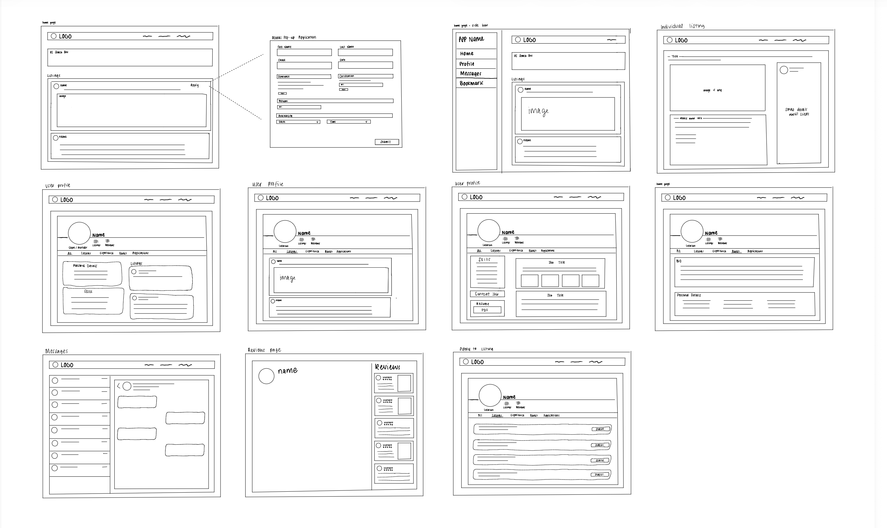

# Project Plan — Side Hustle

---

## 1. Team Name and Pod Members

**Pod name:** Power Panel

**Pod Members:**
- Zainab Adeola
- Ariane Doris Umuhire
- Ardelia Putridaryana

---

## 2. Problem Statement and Solution Description

**Problem Statement**

People who want to earn extra income have no reliable way to discover side hustles that actually match their specific skills, schedule, and financial goals. Whereas people who need services done don't know where to go to discover those who can complete their service for them.

**Solution Description**

The main purpose of our project is to create a centralized platform that connects clients who need tasks, projects, or services completed with workers seeking side hustle income. Clients can post what they need, workers can find opportunities that match their skills and schedule. There is no middleman, just a direct and mutually beneficial connection.

**Target Audience:** People looking for side-hustle income (providers) and people who need a task/service completed (clients).

---

## 3. User Roles and Personas

### User Roles

| Role Name | Description | Notes |
|---|---|---|
| Client | The user who needs a job done. | Can be interchangeable |
| Provider | The user who is looking for a job. | Can be interchangeable |

> Note: A single account can act as both. The `role` column on the `user` table uses a `UserRole` enum: `CLIENT`, `PROVIDER`, or `BOTH`. Role is selected during the onboarding flow. "A client can switch to provider and vice versa."

### User Personas

**Persona 1 — Oscar Grammy**
- **Age:** 17
- **Location:** Oklahoma City, Oklahoma
- **Relationship with technology:** Avid phone user and uses the app weekly for allowance money
- **Motivation:** To get a weekly allowance for leisure spending
- **Pain points:** High school student

**Persona 2 — Aurora Borealis**
- **Age:** 36
- **Location:** Indianapolis, Indiana
- **Relationship with technology:** Uses desktop more often due to work and uses the app occasionally when things need to get done
- **Motivation:** To complete tasks she does not have time to do
- **Pain points:** Orthopedic surgeon who works 12-hour shifts

**Persona 3 — Sara Abraham**
- **Age:** 51
- **Location:** Lincoln, Nebraska
- **Relationship with technology:** Moderately uses technology and is both a mobile and desktop user, but her father George has trouble with it
- **Motivation:** Wants to help her father, who is getting older
- **Pain points:** Daughter of George Abraham (75)

**Persona 4 — Kevin Manzi**
- **Age:** 25
- **Location:** Fort Worth, Texas
- **Relationship with technology:** University student who actively uses all devices (mobile, tablet, desktop)
- **Motivation:** Needs a side hustle to earn extra money
- **Pain points:** Student loans

---

## 4. User Stories

### Core User Stories

| # | User Story (As a... I want... so that...) | Role | Feature Area | Status |
|---|---|---|---|---|
| 1 | As a client, I want to be able to see a provider's skills, so I can know if they can complete the job I want. | Client | Skills Page | Shipped |
| 2 | As a client, I need a list of plumbers near me who can quickly fix my sink. | Client | Location Near Me | Shipped (via location field + search) |
| 3 | As a provider, I want to fill out my bio, so my personality can shine through to clients. | Provider | Bio | Shipped |
| 4 | As a client, I want to be able to show that a job listing has been completed or filled, so I don't get any more providers applying to my listing. | Client | Completed Listing | Shipped |
| 5 | As a provider, I want to be able to talk with my client about the job, so I can get more information about a listing. | Both | Inbox | Shipped |
| 6 | As a client, I want to know which provider is qualified and trustworthy for the job, so I can ensure that my job gets done efficiently and effectively. | Client | Reviews | Shipped |
| 7 | As a client, I want to be able to post my listings with images, so providers can see a visual of the service to be completed. | Client | Post Listings | Shipped (via S3 image upload) |
| 8 | As a client, I want to be able to post a listing with no images, so I can maintain my privacy regarding the service I need completed. | Client | Post Listing | Shipped |
| 9 | As a provider, I want to display my previous work, so I can attract new clients. | Provider | Experience Tab | Shipped (via Experience model) |
| 10 | As a provider, I want to set my profile, so I can attract parents looking for a babysitter. | Provider | User Profile | Shipped (including onboarding flow) |
| 11 | As a client, I want to be able to see all the applicants under my listing, so I can identify providers relevant to the specific listing. | Client | Listing Page | Shipped |
| 12 | As a provider, I want to be able to click into a listing, so I can get more information about the listing. | Provider | Listing Page | Shipped |
| 13 | As a provider, I want to be able to scroll through posted listings and see which ones may interest me. | Provider | Feed Scroll | Shipped |

### AI Feature User Stories

| # | User Story (As a... I want... so that...) | Role | Feature Area | Status |
|---|---|---|---|---|
| AI 1 | As a client, I want to be matched to someone who can do garden work. | Client | AI Matching | Shipped |
| AI 2 | As a provider, I want to use AI to see the best-priced jobs that apply to my skills. | Provider | AI Sorting / Personalized Feed | Shipped |
| AI 3 | As a client, I want to see a suggested price for my job listing, so more people will apply and consider my listing. | Client | AI Listing Price | Shipped |
| AI 4 | As a client, I want to see a list of braiders that match my style, so I can choose one who will do my hair. | Client | AI Search / Chat | Shipped |

### Decisions Log — User Stories

- **Story we debated the scope of:** "As a client, I need a list of plumbers near me who can quickly fix my sink." We debated whether to keep this story plumber-specific or broaden it to all local services. **How we resolved it:** We kept the user-facing example in the story for clarity, but scoped implementation under `Location Near Me` so it supports any service category in the product.
- **Story we cut (and why):** "As a client, I want to upload videos in my listing so providers can better understand my request." We cut this story because it adds high storage and moderation complexity for an early milestone and is not required to validate core marketplace matching.
- **Story that changed after feedback:** Original: "As a client, I want to post my listing with either images or no images." Revised: "As a client, I want to be able to post my listings with images or without images, so providers can understand what I need while I maintain control over my privacy." This revision clarified the user benefit and reduced overlap with Story #8.
- **AI feature story — user benefit we landed on:** For AI pricing, we centered the story on confidence and response rate: clients get a practical suggested price that helps attract qualified applicants faster, instead of focusing on the model or algorithm.

---

## 5. Wireframes

1. **Screen name:** Home / Feed
   
   
   
   - Components implied: Navbar, ListingCard, SearchBar, FilterBar, Footer

2. **Screen name:** Listing Detail
   - Components implied: ListingDetailView, ApplicationModal, ProviderApplicationModal, ApplicationDetailModal

3. **Screen name:** User Profile
   - Components implied: UserProfileView, PublicProfileView, ReviewsPanel, ExperienceDetailView

---

## 6. Data Model

> This section reflects the final shipped schema (Prisma ORM). All types are exact.

### `user`

| Column Name | Type | Description |
|---|---|---|
| id | Int | Primary key |
| first_name | String | First name of the user |
| last_name | String | Last name of the user |
| profile_picture | String? | Profile picture URL |
| image_url | String? | Banner picture URL |
| email | String (unique) | Email of the user for sign in |
| password | String? | Bcrypt-hashed password (null for OAuth users) |
| auth_provider | String | "local" or "google" |
| role | UserRole enum | CLIENT, PROVIDER, or BOTH — set during onboarding |
| created_at | DateTime | Date of profile creation |
| bio | String? | Description of the user |
| categories | String[] | Provider service categories picked during onboarding |
| skills | String[] | List of skills for providers |
| location | String? | Text-based location |
| resume_url | String? | Optional link to resume |
| certification_url | String? | Optional link to certifications |
| stripe_account_id | String? | Provider's Stripe Connect (Express) account ID |
| stripe_customer_id | String? | Client's Stripe Customer ID |

> **Cut from original plan:** `is_client` boolean replaced by `role` enum (`UserRole`). `location` stored as text (not coordinates) — LocationIQ was scoped out due to API key complexity.

### `listing`

| Column Name | Type | Description |
|---|---|---|
| id | Int | Primary key |
| title | String | Title/header of the job listing |
| category | ListingCategory enum | Required category for filtering |
| custom_category | String? | Free-text, only used when category = OTHER |
| image_url | String? | Optional picture (S3 upload) |
| user_id | Int | FK → user (creator) |
| description | String | Description of the job |
| price | Decimal | How much the listing pays |
| skills_required | String[] | Highlighted skills needed |
| location | String | Where this job/service is needed |
| status | ListingStatus enum | OPEN, IN_PROGRESS, or COMPLETED |
| created_by_agent | Boolean | True if AI created this listing |
| created_at | DateTime | Creation timestamp |

### `experience`

> **Not in original plan — built during development.**

| Column Name | Type | Description |
|---|---|---|
| id | Int | Primary key |
| user_id | Int | FK → user (who posted it) |
| job_title | String | Short title of the experience |
| category | ListingCategory enum | Category of the experience |
| custom_category | String? | Free-text for OTHER category |
| description | String | Longer write-up |
| images | String[] | Base64 image data URLs |
| created_at | DateTime | Creation timestamp |

### `bookmark`

| Column Name | Type | Description |
|---|---|---|
| id | Int | Primary key |
| listing_id | Int | FK → listing (cascade on delete) |
| user_id | Int | FK → user |
| created_at | DateTime | When the listing was bookmarked |

> Unique constraint on `(user_id, listing_id)` prevents duplicate bookmarks.

### `review`

| Column Name | Type | Description |
|---|---|---|
| id | Int | Primary key |
| stars | Int | 1–5 rating |
| reviewee_id | Int | FK → user (receiving review) |
| reviewer_id | Int | FK → user (writing review) |
| title | String | Title/header of the review |
| description | String | Description of the review |
| image_url | String? | Optional picture |
| created_at | DateTime | When the review was left |

### `message`

| Column Name | Type | Description |
|---|---|---|
| id | Int | Primary key |
| user_id_from | Int | FK → user (sender) |
| user_id_to | Int | FK → user (recipient) |
| content | String | Message content |
| image_url | String? | Optional attached picture |
| listing_id | Int? | Optional FK → listing (SetNull on delete) |
| created_at | DateTime | When the message was sent |
| read_at | DateTime? | When recipient read it; null = unread |

> **Added from original plan:** `listing_id` context field and `read_at` timestamp.

### `application`

| Column Name | Type | Description |
|---|---|---|
| id | Int | Primary key |
| provider_id | Int | FK → user (applicant) |
| listing_id | Int | FK → listing (cascade on delete) |
| status | ApplicationStatus enum | PENDING, ACCEPTED, or REJECTED |
| phone | String? | Contact phone |
| message | String? | Short note from the applicant |
| created_at | DateTime | When the application was submitted |

> **Changed from original plan:** `first_name` and `last_name` columns removed; applicant info pulled from the linked `user` record instead. `message` field added.

### `payment`

> **Not in original plan — built during development.**

| Column Name | Type | Description |
|---|---|---|
| id | Int | Primary key |
| listing_id | Int | FK → listing (cascade on delete) |
| application_id | Int? | FK → application (SetNull on delete) |
| client_id | Int | FK → user (payer) |
| provider_id | Int | FK → user (payee) |
| amount | Int | Amount in cents |
| currency | String | Default "usd" |
| status | PaymentStatus enum | PENDING, HELD, RELEASED, or REFUNDED |
| stripe_payment_intent_id | String? | Stripe charge ID |
| stripe_transfer_id | String? | Stripe release transfer ID |
| transfer_group | String? | Links charge to transfer |
| stripe_invoice_id | String? | Receipt invoice ID |
| invoice_url | String? | Hosted invoice URL |
| created_at | DateTime | Creation timestamp |
| updated_at | DateTime | Last update timestamp |

### `agent_conversation`

| Column Name | Type | Description |
|---|---|---|
| id | Int | Primary key |
| user_id | Int | FK → user (who started the conversation) |
| messages | Json | Full message history |
| action_taken | String | "matched_providers" \| "matched_listings" \| "created_listing" |
| created_at | DateTime | When the conversation happened |

---

## 7. API Contracts

### User Authentication

| CRUD | HTTP Verb | Endpoint | Description | Request Shape | Response Shape | Error Cases | User Stories |
|---|---|---|---|---|---|---|---|
| Create | POST | `/api/auth/register` | Register a user | `{ name, email, password }` | `{ id, name, email, createdAt }` | 400 if email already exists, or if missing required fields | 10 |
| Create | POST | `/api/auth/login` | Log in an existing user | `{ email, password }` | `{ token, user: { id, name, email } }` | 401 if wrong password, 404 if user not found | 10 |
| Delete | POST | `/api/auth/logout` | Log out existing user | `{ }` | `{ message: "Logged out successfully" }` | 401 if not authenticated | 10 |
| Read | GET | `/api/auth/me` | Get currently logged in user | — | `{ id, name, email, image_url, bio, skills, location }` | 401 if no valid token | 10 |
| Update | PUT | `/api/users/me` | Update user profile | `{ name, image_url, bio, skills, location, resume_url, certification_url }` | `{ id, name, image_url, bio, skills, location, resume_url, certification_url }` | 401 if not authenticated, 404 if user not found | 3, 10 |

### Listing

| CRUD | HTTP Verb | Endpoint | Description | Request Shape | Response Shape | Error Cases | User Stories |
|---|---|---|---|---|---|---|---|
| Create | POST | `/api/listings` | Create a new listing | `{ title, category, custom_category, image_url, description, price, skills_required, location }` | `{ id, title, category, custom_category, description, price, skills_required, location, image_url, status, user_id, created_at }` | 400 if missing required fields, 400 if invalid category, 400 if category is OTHER and custom_category missing, 401 if not authenticated | 7, 8 |
| Read | GET | `/api/listings` | Get all listings (supports `?search=`, `?category=`, `?custom_category=`, `?location=` filters) | — | `[{ id, title, category, custom_category, description, price, skills_required, location, image_url, status, user_id }]` | 400 if invalid category, 404 if listing is not found | 12, 13 |
| Read | GET | `/api/listings/:id` | Get one listing by ID | — | `{ id, title, category, custom_category, description, price, skills_required, location, image_url, status, user_id }` | 404 if listing is not found | 11, 12 |
| Read | GET | `/api/listings/user/:user_id` | Get all listings by a specific user | — | `[{ id, title, category, ... }]` | 404 if user not found | 11 |
| Update | PUT | `/api/listings/:id` | Update a listing | `{ title, category, custom_category, description, price, skills_required, location, image_url, status }` | `{ id, title, ... }` | 400 if invalid category, 404 if listing not found, 401 if not owner | 4, 7 |
| Delete | DELETE | `/api/listings/:id` | Delete a listing | — | `{ message: "Listing deleted successfully" }` | 404 if listing not found, 401 if not owner | 7 |

### Experience

> **Not in original plan — built during development.** Providers post past work to attract clients.

| CRUD | HTTP Verb | Endpoint | Description | Request Shape | Response Shape | Error Cases | User Stories |
|---|---|---|---|---|---|---|---|
| Create | POST | `/api/experiences` | Create an experience | `{ job_title, category, custom_category, description, images }` | `{ id, job_title, category, description, images, user_id, created_at }` | 400 if missing required fields, 401 if not authenticated | 9 |
| Read | GET | `/api/experiences` | Get all experiences (randomized for client feed) | — | `[{ id, job_title, category, description, images, user_id }]` | — | 9 |
| Read | GET | `/api/experiences/user/:userId` | Get experiences by a specific user | — | `[{ id, job_title, ... }]` | 404 if user not found | 9 |
| Read | GET | `/api/experiences/:id` | Get one experience by ID | — | `{ id, job_title, ... }` | 404 if not found | 9 |
| Update | PUT | `/api/experiences/:id` | Update an experience | `{ job_title, category, description, images }` | `{ id, job_title, ... }` | 404 if not found, 401 if not owner | 9 |
| Delete | DELETE | `/api/experiences/:id` | Delete an experience | — | `{ message: "Experience deleted" }` | 404 if not found, 401 if not owner | 9 |

### Review

| CRUD | HTTP Verb | Endpoint | Description | Request Shape | Response Shape | Error Cases | User Stories |
|---|---|---|---|---|---|---|---|
| Create | POST | `/api/reviews` | Create a review | `{ stars, title, description, image_url }` | `{ id, stars, title, description, image_url, reviewee_id, reviewer_id }` | 400 if missing required fields, 401 if not authenticated | 6 |
| Read | GET | `/api/reviews/:id` | Get one review by ID | — | `{ id, stars, title, description, image_url, reviewee_id, reviewer_id }` | 404 if review not found | 6 |
| Read | GET | `/api/reviews/user/:user_id` | Get all reviews for a specific user | — | `[{ id, stars, title, description, image_url, reviewee_id, reviewer_id }]` | 404 if user not found | 6 |
| Delete | DELETE | `/api/reviews/:id` | Delete a review | — | `{ message: "Review deleted successfully" }` | — | 6 |

### Messages

| CRUD | HTTP Verb | Endpoint | Description | Request Shape | Response Shape | Error Cases | User Stories |
|---|---|---|---|---|---|---|---|
| Create | POST | `/api/messages` | Send a message | `{ user_id_to, content, image_url }` | `{ id, user_id_from, user_id_to, content, image_url, created_at }` | 400 if missing required fields, 401 if not authenticated, 404 if recipient not found | 5 |
| Read | GET | `/api/messages/:user_id` | Get all messages between current user and another user | — | `[{ id, user_id_from, user_id_to, content, image_url, created_at }]` | 404 if no messages found, 401 if not authenticated | 5 |
| Read | GET | `/api/messages/inbox` | Get all conversations for current user (inbox) | — | `[{ user_id_from, user_id_to, content, created_at }]` | 401 if not authenticated | 5 |

### Application

| CRUD | HTTP Verb | Endpoint | Description | Request Shape | Response Shape | Error Cases | User Stories |
|---|---|---|---|---|---|---|---|
| Create | POST | `/api/applications` | Apply to a listing | `{ listing_id, phone, message }` | `{ id, provider_id, listing_id, status, created_at, phone, message }` | 400 if already applied, 401 if not authenticated, 404 if listing not found | 12 |
| Read | GET | `/api/applications/listing/:listing_id` | Get all applications for a listing (client view) | — | `[{ id, provider_id, listing_id, status, created_at, phone, message }]` | 404 if no listing found, 401 if not authenticated | 11 |
| Read | GET | `/api/applications/user` | Get all applications by current user (provider view) | — | `[{ id, provider_id, listing_id, status, created_at }]` | 401 if not authenticated | 12 |
| Update | PUT | `/api/applications/:id` | Accept or reject an application | `{ status }` | `{ id, provider_id, listing_id, status }` | 404 if application not found, 401 if not listing owner | 11 |
| Delete | DELETE | `/api/applications/:id` | Withdraw an application (provider view) | — | `{ message: "Application withdraw" }` | 404 if application not found, 401 if not applicant | 12 |

### Bookmark

| CRUD | HTTP Verb | Endpoint | Description | Request Shape | Response Shape | Error Cases | User Stories |
|---|---|---|---|---|---|---|---|
| Create | POST | `/api/bookmarks` | Bookmark a listing | `{ listing_id }` | `{ id, user_id, listing_id, created_at }` | 400 if already bookmarked, 401 if not authenticated | 13 |
| Read | GET | `/api/bookmarks` | Get all bookmarks for current user | — | `[{ id, listing_id, user_id, created_at }]` | 401 if not authenticated | 13 |
| Delete | DELETE | `/api/bookmarks/:id` | Remove a bookmark | — | `{ message: "Bookmark removed successfully" }` | 404 if bookmark not found, 401 if not owner | 13 |

### Payments (Stripe)

> **Not in original plan as a full feature — designed and built during Sprint 3/4.**

| CRUD | HTTP Verb | Endpoint | Description | Request Shape | Response Shape | Error Cases |
|---|---|---|---|---|---|---|
| Create | POST | `/api/payments/create-intent` | Client starts paying for an accepted application | `{ listing_id, application_id }` | `{ client_secret, payment_id }` | 401, 400 if application not accepted |
| Update | POST | `/api/payments/:id/release` | Client releases held funds to provider | — | `{ status: "RELEASED" }` | 401, 404 |
| Create | POST | `/api/payments/:id/invoice` | Generate a receipt (Stripe invoice) | — | `{ invoice_url }` | 401, 500 |
| Read | GET | `/api/payments/listing/:listingId` | Get payment status for a listing | — | `{ id, status, amount, ... }` | 401, 404 |

### Stripe Connect (Provider Onboarding)

> **Not in original plan — built during development to support Stripe payouts.**

| CRUD | HTTP Verb | Endpoint | Description |
|---|---|---|---|
| Create | POST | `/api/connect/onboard` | Create or reuse a provider Express account; returns hosted onboarding link |
| Read | GET | `/api/connect/status` | Check whether a provider has finished Stripe Connect onboarding |

### Agent

| CRUD | HTTP Verb | Endpoint | Description | Request Shape | Response Shape | Error Cases | User Stories |
|---|---|---|---|---|---|---|---|
| Create | POST | `/api/agent/match` | Send a query to the AI agent for provider or listing matching | `{ query, user_id, context: { skills, location, recent_listings } }` | `{ results: [...], agent_message, action_taken }` | 401 if not authenticated, 500 if agent fails | AI 1, AI 2, AI 4 |
| Create | POST | `/api/agent/create-listing` | Send a description to the agent to create a listing | `{ query, user_id }` | `{ listing: { ... }, agent_message }` | 400 if agent can't extract enough info, 401, 500 | AI 3 |
| Read | GET | `/api/agent/history/:user_id` | Get past agent interactions | — | `[{ query, action, results, created_at }]` | 401 | AI 1, AI 3 |

### Price Intelligence

> **Not in original plan — built as a standalone AI service.**

| CRUD | HTTP Verb | Endpoint | Description | Request Shape | Response Shape |
|---|---|---|---|---|---|
| Create | POST | `/api/prices/recommendations` | Get price suggestions based on similar listings | `{ category, location, description }` | `{ recommendedPrice, priceRange, similarListings, reasoning }` |

### Recommendations (Personalized Feed)

> **Not in original plan — built as a standalone AI service.**

| CRUD | HTTP Verb | Endpoint | Description | Response Shape |
|---|---|---|---|---|
| Read | GET | `/api/recommendations` | Get open listings re-ordered by AI to match the logged-in provider's skills | `{ listings, personalized, message? }` |

### Upload

| CRUD | HTTP Verb | Endpoint | Description |
|---|---|---|---|
| Create | POST | `/api/upload` | Upload an image to S3; returns a public URL |

---

## 8. State Architecture

### Client-side states

| State Variable | Type | Initial Value | Owner | Trigger |
|---|---|---|---|---|
| current_user | object or null | null | App | Successful login/logout |
| role | enum (CLIENT/PROVIDER/BOTH) | null | App | Set on login based on user data |
| listings | array | [] | App | Fetch on home page load, new listing posted |
| selected_listing | object or null | null | App | User clicks a listing card |
| applications | array | [] | App | Fetch when clients view their listing |
| conversations | array | [] | App | Fetch when inbox is open |
| messages | array | [] | MessagesView | User opens up a conversation |
| reviews | array | [] | Profile | Fetch when profile is loaded |
| experiences | array | [] | Profile | Fetch when profile is loaded |
| is_loading | boolean | false | App | Any API call start and end |
| error | string or null | null | App | Any failed API call |
| search_query | string | "" | HomeView | User types in search bar |
| agent_query | string | "" | AIAgentModal | User types a description |
| agent_status | string | "idle" | App | Agent starts, finishes, or errors |
| agent_result | array | [] | App | Agent returns matches |
| agent_messages | array | [] | AIAgentModal | Each step the agent takes |
| agent_action | string or null | null | App | Tells app whether agent is matching or creating |
| pending_listing | object or null | null | App | Agent extracted listing info, waiting for user confirmation |
| agent_error | string or null | null | App | Agent call fails |

---

## 9. AI Feature Specification

### AI Features Shipped

Four distinct AI features were built and shipped:

#### 1. AI Chatbot (Matching + Listing Creation)
**What it does:** A chat-style modal where users describe what they need in plain language. The agent matches providers or listings, or creates a listing on the user's behalf.

**Where:** `AIAgentModal` component, triggered from the home feed.

**Input:**
```
{
  query: string,
  user_id: integer,
  is_client: boolean,
  context: {
    skills: [],
    location: string,
    recent_listings: []
  }
}
```

**Output:**
```
{
  agent_message: string,
  results: [{ id, name, skills, location, match_score, reason }],
  action_taken: string
}
```

**Endpoints:** `POST /api/agent/match`, `POST /api/agent/create-listing`, `GET /api/agent/history/:user_id`

#### 2. Price Intelligence
**What it does:** Analyzes existing open listings in the same category and location to suggest a competitive price when a client creates a listing.

**Where:** `CreateListingView` — price suggestion appears as the user selects a category.

**Endpoint:** `POST /api/prices/recommendations`

**Output:** `{ recommendedPrice, priceRange, similarListings, reasoning }`

#### 3. Personalized Feed (Provider)
**What it does:** When a provider views the home feed, the AI re-orders open listings to surface the jobs that best match their skills and history first. Each card shows a `reason` string explaining the match.

**Where:** `HomeView` — replaces the default newest-first order for logged-in providers.

**Endpoint:** `GET /api/recommendations`

#### 4. AI Applicant Ranking
**What it does:** When a client views applicants for their listing, the AI ranks them best-fit first with a short reason per applicant.

**Where:** `ListingDetailView` — applicants tab for listing owners.

**Service:** `applicantRankingService.js`

---

### Validation

_Good response:_
- Returns at least 1 relevant result that matches the user's described need
- The `reason` field explains the match in plain language the user understands
- For listing creation, all required fields are extracted correctly from the user's description
- Agent asks a follow-up question if the description is too vague rather than returning empty results

_Bad response:_
- Returns providers or listings that have no relation to the user's query
- Creates a listing with missing required fields like price or skills
- Returns an empty results array with no explanation
- Hallucinates provider names or listing details not in the database

### Fallback Behavior
- Agent call fails entirely → "Something went wrong. Try searching manually below."
- Agent returns no results → "I couldn't find any matches for that. Try adjusting your description or browse all listings."
- Agent can't extract enough info to create a listing → "I need a bit more detail — can you tell me the price range and what skills are needed?"
- Agent takes too long → Loading indicator, then "This is taking longer than usual. Please try again."

### AI Feature Decisions Log

| Decision | Context | Alternatives Considered | Tradeoffs |
|---|---|---|---|
| AI calls run on backend | Need to keep API keys secure and access database. | Frontend AI calls. | More secure but slightly slower. |
| Chat-style input instead of forms | Users describe what they need in plain language. | Search filters with dropdowns. | More flexible but less precise. |
| Store conversation history | Users can review past AI interactions. | Only store final results. | Uses more storage but helpful for debugging. |
| Separate match and create endpoints | Different actions need different validation. | Single `/api/agent` endpoint. | Clearer API but more routes to maintain. |
| Built price intelligence as a separate service (not the chatbot) | Price suggestions needed at listing creation time, not conversationally. | Add pricing to the agent chatbot. | Simpler UX — a suggestion appears inline without requiring chat. |
| Built personalized feed as a separate service | Provider feed re-ordering is automatic, not user-initiated — doesn't fit chat UX. | Surface it through the AI chatbot. | Feed personalizes silently; no extra interaction step for the user. |
| Built applicant ranking as a separate service | Ranking happens when a client opens their applicants list, not in chat. | Manual sort by application date. | Clients see best fits first without extra effort; AI handles the comparison. |
| Anti-hallucination guard in ranking and recommendation services | AI is only allowed to re-order real IDs from the database, never invent new ones. | Trust AI output directly. | Prevents fabricated provider names/listings from ever reaching the UI. |

---

## 10. Features Built But Not in Original Plan

These features were scoped and built during development and were not in the Sprint 1 plan:

| Feature | Description | Where It Lives |
|---|---|---|
| Experience model and CRUD | Providers post past work (images + write-up) to attract clients | `ExperienceDetailView`, `/api/experiences` |
| Stripe payment flow (escrow model) | Client pays → funds held → released on job completion | `PaymentModal`, `/api/payments` |
| Stripe Connect onboarding | Providers connect their bank account to receive payouts | `ConnectOnboarding`, `/api/connect` |
| Image upload via S3 | Photos for listings, reviews, and experiences stored in AWS S3 | `uploadController`, `/api/upload` |
| Onboarding flow | Multi-step welcome → role selection → profile setup → provider services | `Onboarding/` components |
| AI applicant ranking | Applicants on a listing ranked best-fit first by AI | `applicantRankingService.js` |
| AI personalized feed | Provider home feed re-ordered by AI based on skills | `recommendationService.js` |
| Google OAuth | Sign in with Google in addition to email/password | `authController`, `AuthSuccess`/`AuthFailure` components |
| Read receipts on messages | `read_at` timestamp on each message | `message` model |
| Stripe webhook handler | Handles Stripe payment lifecycle events server-side | `webhookController` |

---

## Decisions Log

| Decision | Context | Alternatives Considered | Tradeoffs |
|---|---|---|---|
| Switched from LocationIQ to plain text location | LocationIQ required credit card for production access; location stored as a searchable text field instead of coordinates. | LocationIQ, Mapbox | Text search is simpler and works for MVP; no geofencing or radius search. |
| Used dayjs library for time and date | Helps with storing and displaying dates without manual parsing. | Manual date handling | Dayjs saves time; adds one dependency. |
| Made bookmark a separate model | Bookmark is a many-to-many relationship between user and listing. | Boolean on listing | A separate model correctly handles the many-to-many case. |
| Used Prisma ORM instead of raw SQL | Prisma gives type-safe database access and migration tooling. | pg with raw SQL | Prisma speeds up development; students must learn schema files instead of raw SQL. |
| Used `UserRole` enum instead of `is_client` boolean | A single boolean can't represent "both" — users can be clients and providers. | Two booleans (`is_client`, `is_provider`) | Enum is cleaner and extensible. |
| Implemented Stripe escrow model (hold → release) | Clients need to trust funds are safe; providers need guaranteed payment. | Direct transfer, manual payment | Escrow protects both sides but adds complexity (two Stripe operations per job). |
| Built Google OAuth | Reduces friction at registration; many users prefer not creating a new password. | Email/password only | OAuth adds auth complexity but improves conversion. |
| **Sprint 2:** Add fixed category filter buttons to homepage | Users need quick way to filter listings by service type instead of scrolling through everything. | Search bar only, dynamic categories from database | Fixed categories are simple; don't scale if new service types emerge — handled by the OTHER + custom_category pattern. |
| **Sprint 2:** Add toggle switch for client/provider homepage views | Single user can be both client and provider, needs different layouts. | Separate dashboard pages, unified view | Toggle is convenient but adds UI complexity. |
| **Sprint 2:** Wire reviews to user profile page | Reviews should display on provider profiles so clients can evaluate trustworthiness. | Separate reviews page | Showing on profile is most intuitive and matches user story 6. |
| **Sprint 2:** Deploy website to production | Need live URL for demo, testing, and presentation. | Vercel, Railway, Heroku, AWS | Render offers free tier for full-stack PERN apps with Postgres. |
| **Sprint 2:** Implement edit listing feature | Clients need ability to update listing details after posting. | No edit (delete and repost) | Full edit capability gives best UX and matches user story 4. |

---
